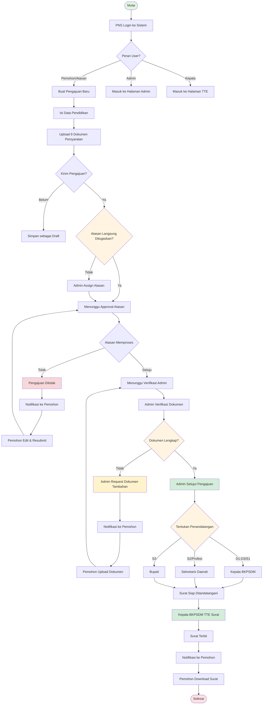
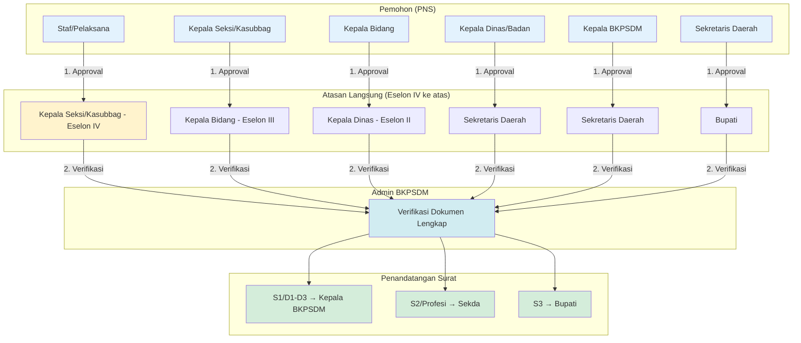
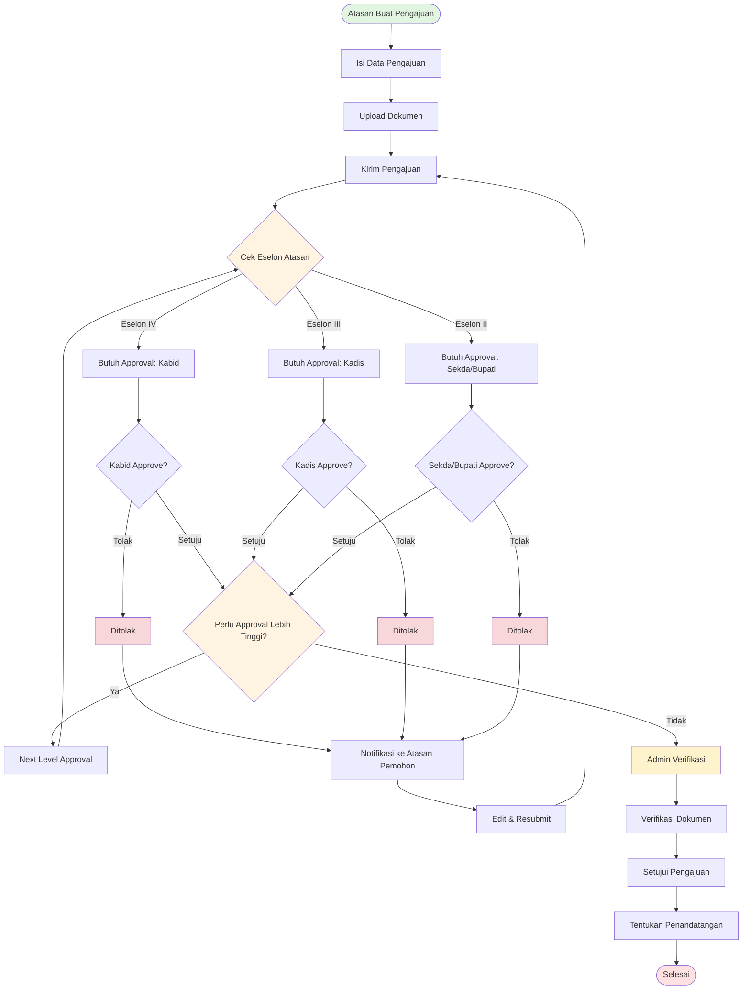
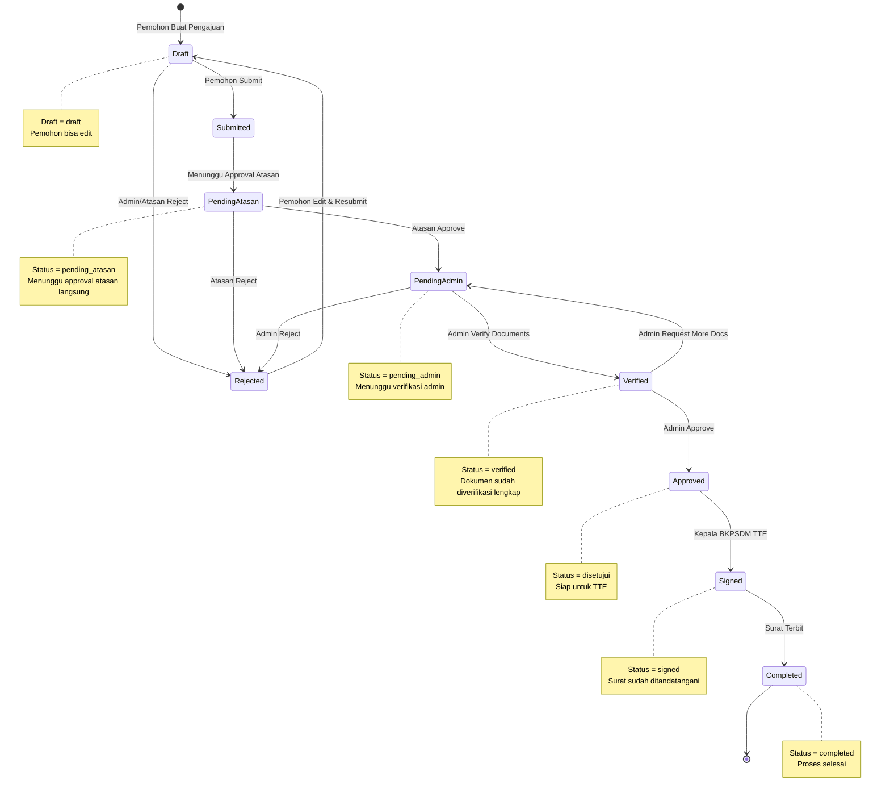
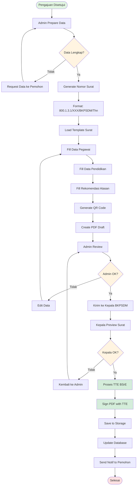
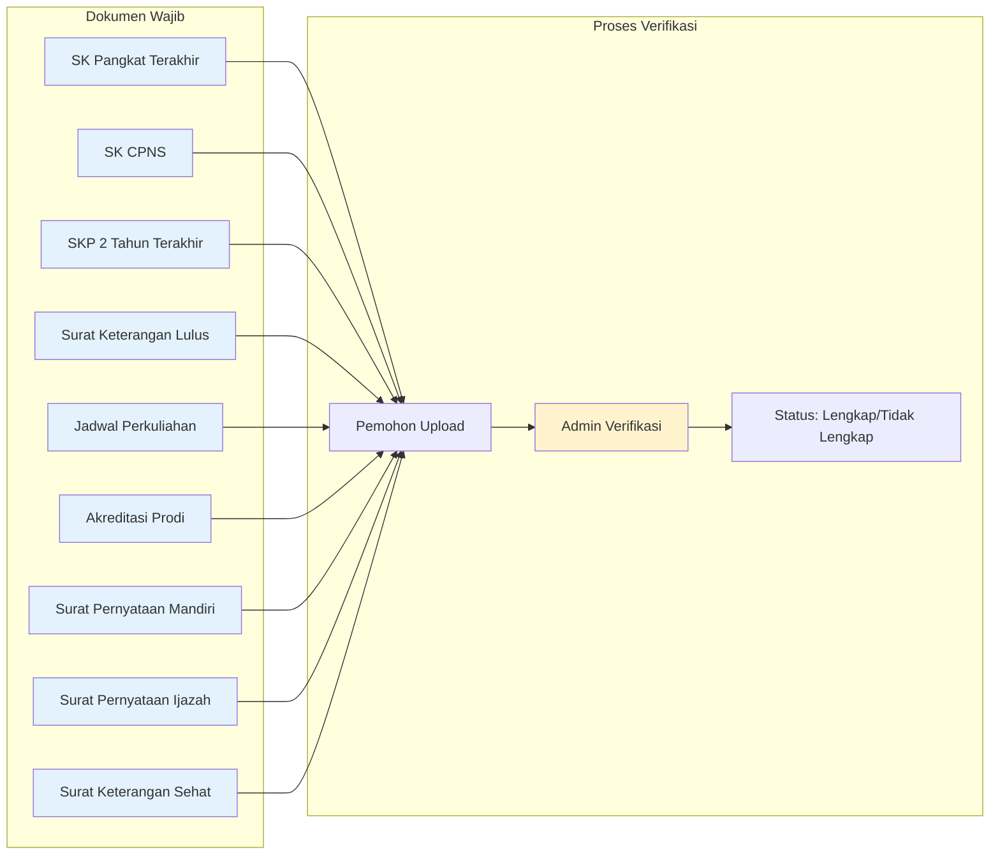

# Alur Bisnis Sistem Surat Izin Belajar Mandiri (SIPINTAR)

## 1. Alur Utama Pengajuan (End-to-End)



## 2. Alur Verifikasi Dokumen Admin

```mermaid
flowchart LR
    Start([Admin Buka Halaman Verifikasi]) --> List[Daftar Pengajuan pending_admin]
    List --> Select[Pilih Pengajuan]
    Select --> OpenModal[Buka Modal Verifikasi]

    OpenModal --> Review[Review Data Pegawai]
    Review --> ReviewPend[Review Data Pendidikan]
    ReviewPend --> ShowChain[Tampilkan Alur Verifikasi]

    ShowChain --> Docs{Dokumen Tersedia?}

    Docs -->|Tidak Ada| NoDocs[Mark: Tidak Ada Dokumen]
    Docs -->|Ada| LoopDoc[Loop 9 Jenis Dokumen]

    LoopDoc --> Preview[Preview Dokumen]
    Preview --> VerifyCheck{Dokumen Valid?}

    VerifyCheck -->|Ya| MarkComplete[Check: Lengkap]
    VerifyCheck -->|Tidak| MarkIncomplete[Check: Tidak Lengkap]
    VerifyCheck -->|Perlu Catatan| AddNote[Tambah Catatan]

    MarkComplete --> NextDoc{Masih Ada Dokumen?}
    MarkIncomplete --> NextDoc
    AddNote --> NextDoc

    NextDoc -->|Ya| LoopDoc
    NextDoc -->|Tidak| AllDone{Semua Lengkap?}

    AllDone -->|Ya| EnableBtn[Enable: Setujui Button]
    AllDone -->|Tidak| ShowWarning[Tampilkan Warning]

    EnableBtn --> Decision{Admin Aksi?}
    ShowWarning --> Decision

    Decision -->|Tolak| RejectModal[Modal Reject]
    Decision -->|Setuju| Approve[Approve Pengajuan]
    Decision -->|Tutup| CloseModal[Tutup Modal]

    RejectModal --> InputReason[Input Alasan Penolakan]
    InputReason --> ConfirmReject[Konfirmasi Reject]
    ConfirmReject --> UpdateStatus[Update Status: Ditolak]
    UpdateStatus --> NotifyUser[Notifikasi ke Pemohon]
    NotifyUser --> End([Selesai])

    Approve --> UpdateApprove[Update Status: Disetujui]
    UpdateApprove --> NotifyApprove[Notifikasi ke Pemohon]
    NotifyApprove --> DetermineSigner
    CloseModal --> End

    DetermineSigner --> SignFlow[Siapkan untuk Penandatangan]
    SignFlow --> End

    style Start fill:#e1f5e1
    style End fill:#ffe1e1
    style VerifyCheck fill:#fff4e1
    style Decision fill:#fff4e1
    style MarkComplete fill:#d4edda
    style MarkIncomplete fill:#f8d7da
    style EnableBtn fill:#d4edda
```



## 3. Matriks Verifikasi Berdasarkan Jabatan



### Flow Verifikasi Staff

```
┌─────────────────────────────────────────────────────────────────┐
│                    FLOW VERIFIKASI STAF                         │
└─────────────────────────────────────────────────────────────────┘

  [STAF / PELAKSANA]
       │
       │ 1. Submit Pengajuan
       ▼
  [ESOLON IV - Kepala Seki/Kasubbag]
       │
       │ • Review kelayakan izin belajar
       │ • Pertimbangkan beban kerja unit
       │ • Approve/Reject
       ▼
  [ADMIN BKPSDM]
       │
       │ 2. Verifikasi Kelengkapan Dokumen
       │ • Cek 9 dokumen persyaratan
       │ • Verifikasi keaslian dokumen
       │ • Approve/Reject
       ▼
  [PENANDATANGANAN SURAT]
       │
       │ D1/D2/D3/S1 → Kepala BKPSDM
       │ S2/Profesi → Sekda
       │ S3 → Bupati
       ▼
  [SURAT TERBIT]
```

### Catatan Penting untuk Staff:

1. **Atasan Langsung untuk Staff adalah Eselon IV (Kepala Seki/Kasubbag)**
   - Bukan Admin BKPSDM
   - Harus di unit kerja yang sama
   - Ditugaskan melalui field `atasan_id` di tabel users

2. **Dua Level Verifikasi untuk Staff:**
   - Level 1: Eselon IV (Kepala Seki/Kasubbag) - Approval kelayakan
   - Level 2: Admin BKPSDM - Verifikasi dokumen

3. **Jika Staff tidak memiliki Atasan:**
   - Sistem akan menampilkan warning: "Atasan belum ditetapkan"
   - Admin perlu menugaskan atasan melalui menu Pegawai

## 4. Alur Approval Atasan yang Mengajukan



## 5. Status Flow Pengajuan



## 6. Alur Generate Surat Tugas



## 7. Dokumen Persyaratan (9 Jenis)



## 8. Role & Permission Matrix

```mermaid
graph TB
    subgraph Roles["User Roles"]
        Pemohon[Pemohon PNS]
        Atasan[Atasan Langsung]
        Admin[Admin BKPSDM]
        Kepala[Kepala BKPSDM]
    end

    subgraph Permissions["Permissions"]
        PM1[Buat Pengajuan Sendiri]
        PM2[Edit Pengajuan Draft]
        PM3[Upload Dokumen]
        PM4[Lihat Pengajuan Sendiri]
        PM5[Download Surat]

        AT1[Buat Pengajuan Sendiri]
        AT2[Approve Pengajuan Unit Kerja]
        AT3[Lihat Pengajuan Unit Kerja]
        AT4[Reject Pengajuan]

        AD1[Verifikasi Dokumen]
        AD2[Approve/Reject Pengajuan]
        AD3[Generate Surat]
        AD4[Manage Pegawai]
        AD5[Sync PDDikti]
        AD6[Assign Atasan]

        KP1[Preview Surat]
        KP2[TTE Surat]
        KP3[Lihat Semua Pengajuan]
    end

    Pemohon --> PM1 & PM2 & PM3 & PM4 & PM5
    Atasan --> AT1 & AT2 & AT3 & AT4
    Admin --> AD1 & AD2 & AD3 & AD4 & AD5 & AD6
    Kepala --> KP1 & KP2 & KP3

    style Pemohon fill:#e3f2fd
    style Atasan fill:#fff3cd
    style Admin fill:#ffe1e1
    style Kepala fill:#d4edda
```



## Ringkasan Status Pengajuan

| Kode Status | Nama Status | Deskripsi | Dapat Edit |
|------------|-------------|-----------|-----------|
| `draft` | Draft | Pengajuan belum dikirim | Ya |
| `submitted` | Terkirim | Menunggu verifikasi | Tidak |
| `pending_atasan` | Pending Atasan | Menunggu approval atasan | Tidak |
| `pending_admin` | Pending Admin | Menunggu verifikasi admin | Tidak |
| `verified` | Terverifikasi | Dokumen lengkap, menunggu approve | Tidak |
| `disetujui` | Disetujui | Siap untuk TTE | Tidak |
| `signed` | Ditandatangani | Surat sudah TTE | Tidak |
| `completed` | Selesai | Proses selesai | Tidak |
| `ditolak` | Ditolak | Pengajuan ditolak | Ya (resubmit) |

## Ringkasan API Endpoints

### Pengajuan
- `GET /api/pengajuan` - List pengajuan
- `POST /api/pengajuan` - Create pengajuan
- `GET /api/pengajuan/{id}` - Detail pengajuan
- `PUT /api/pengajuan/{id}` - Update pengajuan
- `DELETE /api/pengajuan/{id}` - Delete pengajuan
- `POST /api/pengajuan/{id}/submit` - Submit pengajuan

### Approval & Verification
- `POST /api/pengajuan/{id}/approve` - Approve pengajuan (admin)
- `POST /api/pengajuan/{id}/reject` - Reject pengajuan
- `PUT /api/dokumen/{id}/verify` - Verify individual document

### Verification Info
- `GET /api/verification/pengajuan/{id}` - Get verification chain & signer
- `GET /api/verification/rules` - List verification rules
- `GET /api/verification/categories` - List jabatan categories

### Surat
- `POST /api/pengajuan/{id}/generate-surat` - Generate surat
- `GET /api/surat/{id}` - Get surat
- `POST /api/surat/{id}/sign-tte` - Sign surat with TTE
- `GET /api/surat/{id}/download` - Download surat
