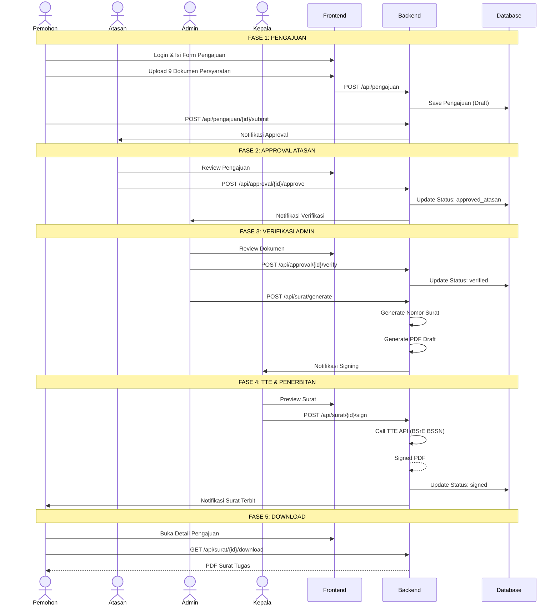
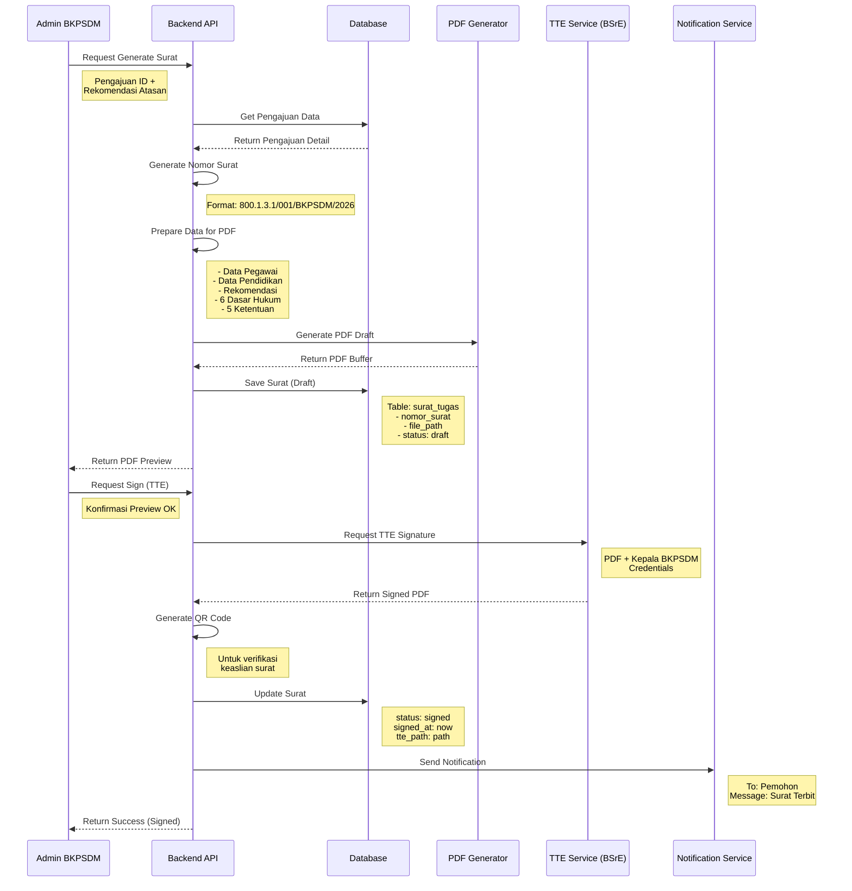
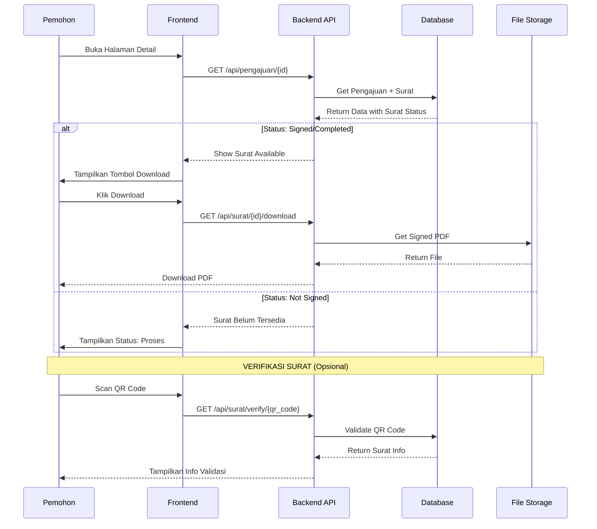
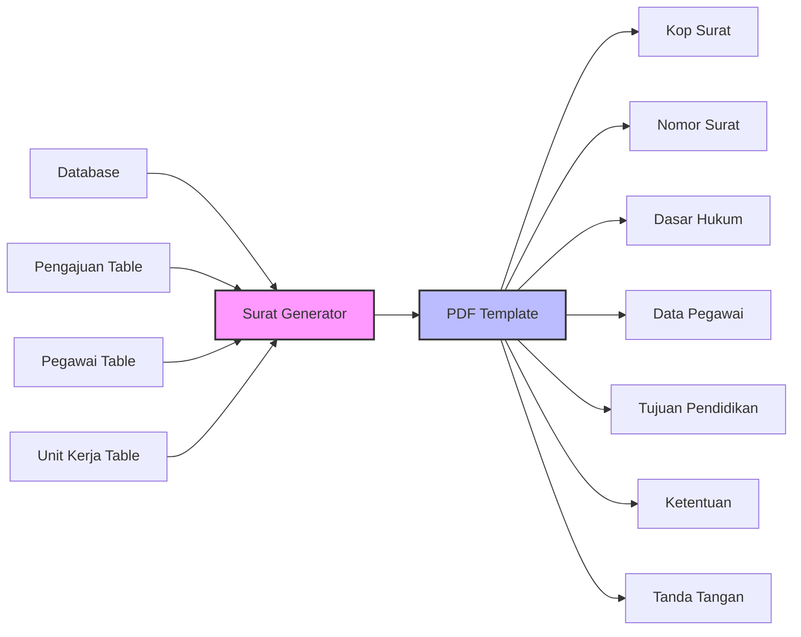
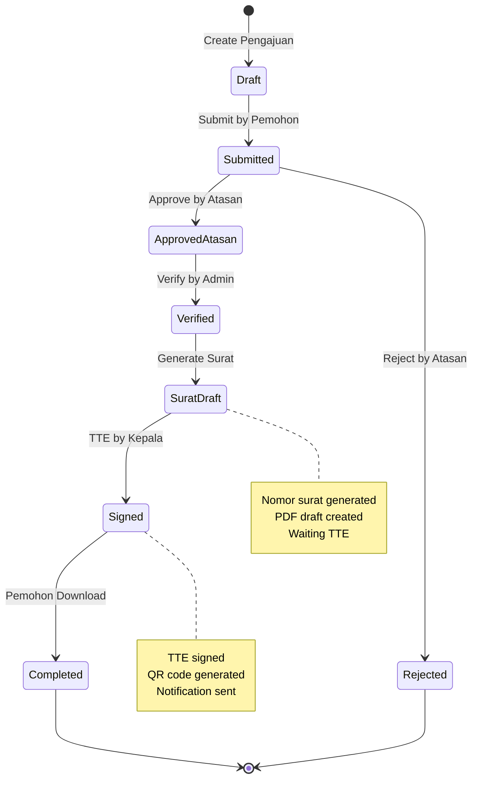
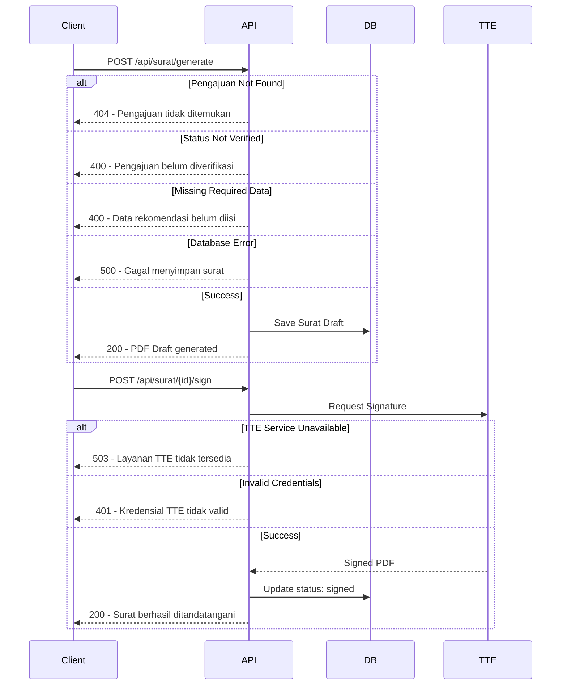

# Sequence Diagram - Alur Pembuatan Surat Tugas Belajar Mandiri

## Overview

Dokumen ini menjelaskan alur lengkap pembuatan Surat Tugas Belajar Mandiri mulai dari pengajuan hingga surat terbit dan dapat didownload oleh pemohon.

---

## 1. Alur Utama (High Level)



---

## 2. Detail Generate Surat Tugas



---

## 3. Detail Download & Verifikasi Surat



---

## 4. Mapping Data ke Template Surat



### Detail Mapping:

| Section | Source Table | Fields |
|---------|--------------|--------|
| **Kop Surat** | Static | PEMERINTAH KABUPATEN SUKABUMI - BKPSDM |
| **Nomor Surat** | surat_tugas | nomor_surat (auto-generated) |
| **Dasar Hukum 1-5** | Static | UU 20/2003, UU 20/2023, PP 17/2020, Perda 3/2024, Perbup 2/2022 |
| **Dasar Hukum 6** | pengajuan | Surat rekomendasi atasan (manual input) |
| **Nama** | pegawai | nama |
| **NIP** | pegawai | nip |
| **Pangkat/Gol** | pegawai | pangkat, golongan |
| **Jabatan** | pegawai | jabatan |
| **Unit Kerja** | pegawai | unit_kerja |
| **Jenjang** | pengajuan | jenjang_id |
| **Program Studi** | pengajuan | nama_prodi |
| **Perguruan Tinggi** | pengajuan | perguruan_tinggi |
| **Ketentuan 1-5** | Static | 5 pasal tetap |
| **Tanda Tangan** | surat_tugas | TTE Kepala BKPSDM |

---

## 5. State Transitions



---

## 6. Error Handling



---

## 7. Entities & Relationships

```
┌──────────────────┐       ┌──────────────────┐
│     pegawai      │       │    pengajuan     │
├──────────────────┤       ├──────────────────┤
│ id               │       │ id               │
│ nama             │◄──────│ pegawai_id       │
│ nip              │       │ jenjang_id       │
│ pangkat          │       │ nama_prodi       │
│ golongan         │       │ perguruan_tinggi │
│ jabatan          │       │ status           │
│ unit_kerja_id    │       │ created_at       │
└──────────────────┘       └────────┬─────────┘
                                    │
                                    │ 1
                                    │
                                    │ 1
                                    ▼
                           ┌──────────────────┐
                           │    surat_tugas    │
                           ├──────────────────┤
                           │ id               │
                           │ pengajuan_id     │
                           │ nomor_surat      │
                           │ file_path        │
                           │ tte_path         │
                           │ qr_code          │
                           │ status           │
                           │ signed_at        │
                           │ signed_by        │
                           └──────────────────┘
```

---

## Ringkasan API Endpoints

| Endpoint | Method | Request | Response |
|----------|--------|---------|----------|
| `/api/surat/generate` | POST | `{ pengajuan_id, rekomendasi_nomor, rekomendasi_tanggal }` | `{ surat_id, nomor_surat, pdf_url }` |
| `/api/surat/{id}/preview` | GET | - | PDF File |
| `/api/surat/{id}/sign` | POST | `{ credentials }` | `{ status: signed, pdf_url }` |
| `/api/surat/{id}/download` | GET | - | PDF File |
| `/api/surat/verify/{qr}` | GET | - | `{ valid: true, surat_info }` |

---

*Document Version: 1.0*
*Last Updated: 2026-05-20*
